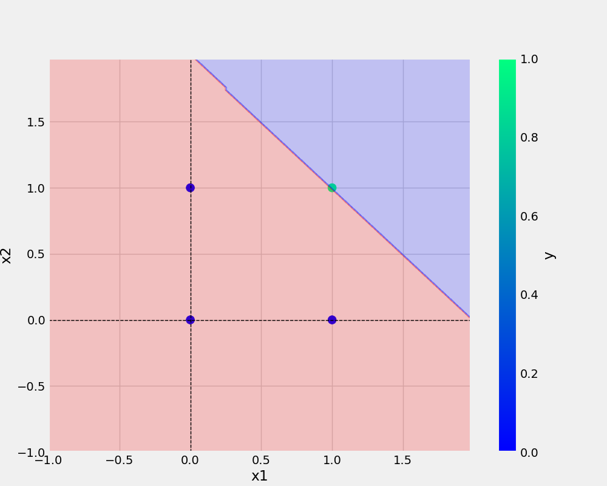

# oneNeuron
oneNeuron | Perceptron

#Commands used
```bash
git add . && git commit -m "docstring updated" && git push origin main
```
#somechangesssssssss

## add url -
[Git handbook](https://guides.github.com/introduction/git-handbook/)

## add image -
# copy the relative link and paste


# copy the image tag link, gives more control
